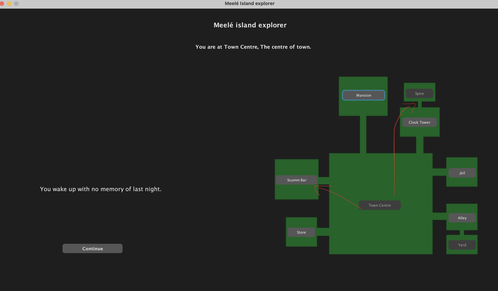
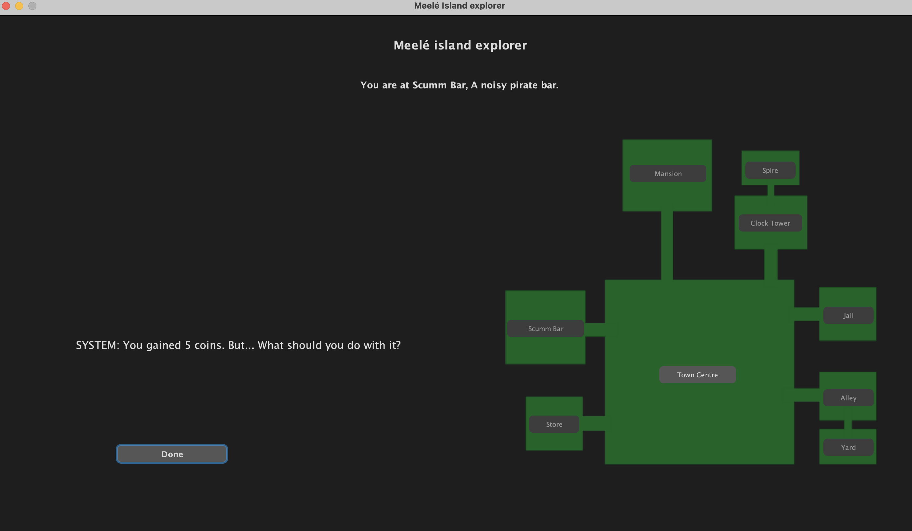
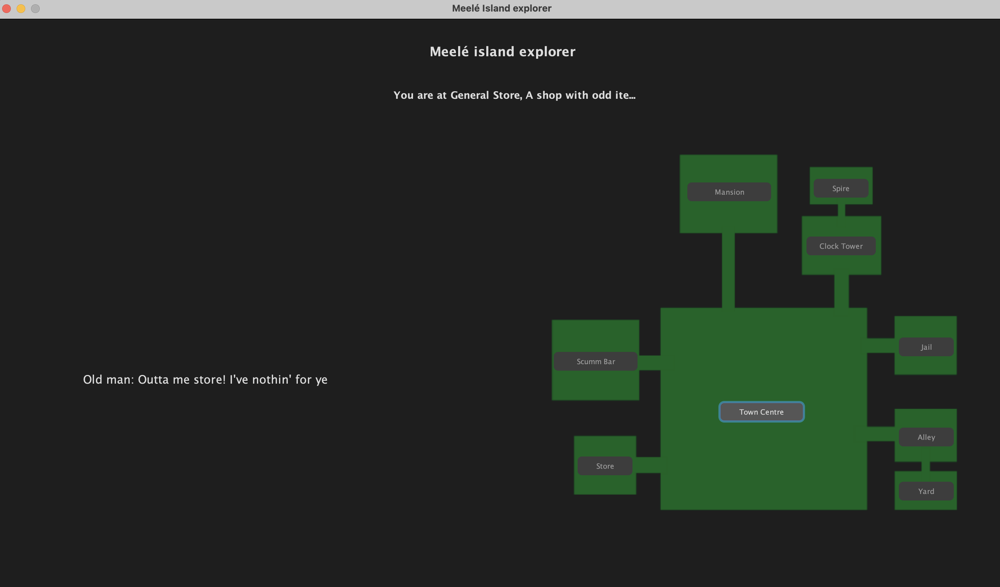
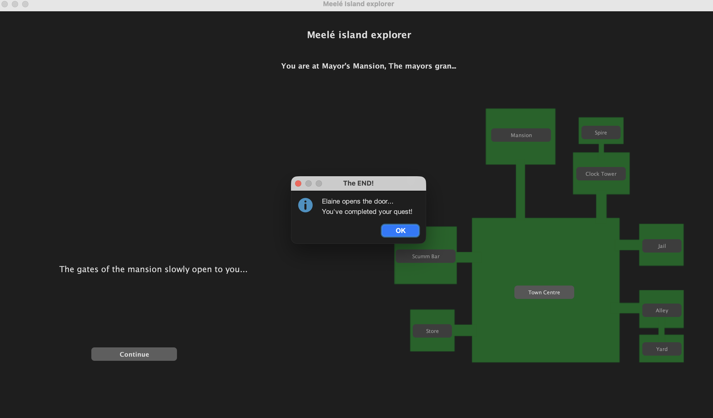

# Results of Testing

The test results show the actual outcome of the testing, following the [Test Plan](test-plan.md)

---

## Game Setup

Start game > No input needed = Instructions should show. 

### Test Data Used

No input. Just lauched game. 

### Test Result

Instructions appeared before any actions were able. + player has no items.

---

## Player Movement

Testing bounds of movement through connected and not connected locations

### Test Data Used

Clicked Bar (connected) and Spire (not connected) from Town Centre.

### Test Result

Player moved to the Bar without issue. Spire button was greyed out and could not be clicked.

---

## Completing a Quest

Completed the letter > went to bar 

### Test Data Used

Completed the Town Centre letter sequence then visited the Scumm Bar.

### Test Result

Bar quest started dialog and gave the coins at the end of the quest. 

---

## Visiting Without the Required Item

Visiting a location without required item

### Test Data Used

Visited the Store without the coins item.

### Test Result

noQuest dialogue displayed and no action button appeared.

---

## Win

Example test description. Example test description.Example test description. Example test description.Example test description. Example test description.

### Test Data Used

Completed all quests in order to obtain the Mushy Banana then triggered the ending at the Mansion.

### Test Result

Ending dialog appeared and action button was hidden.

---